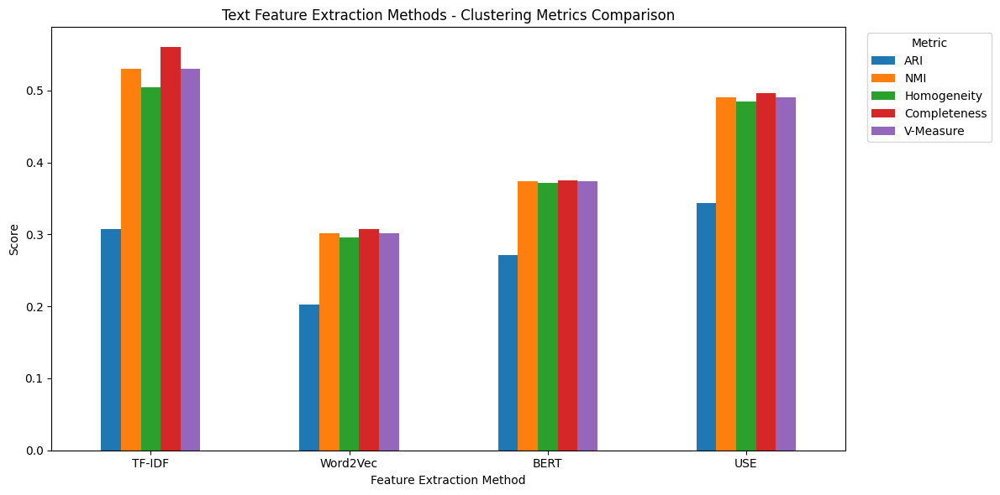
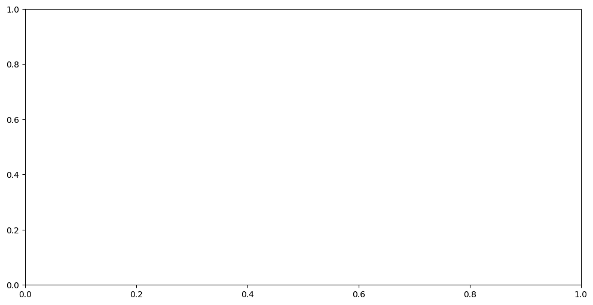
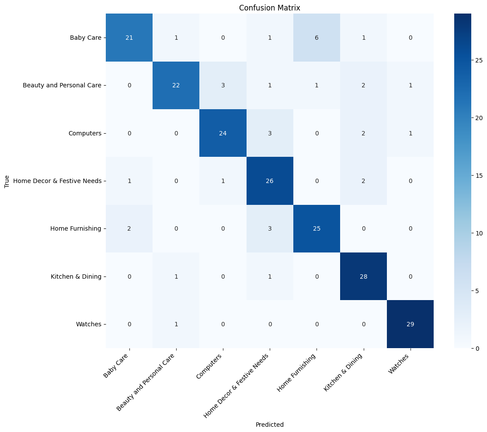
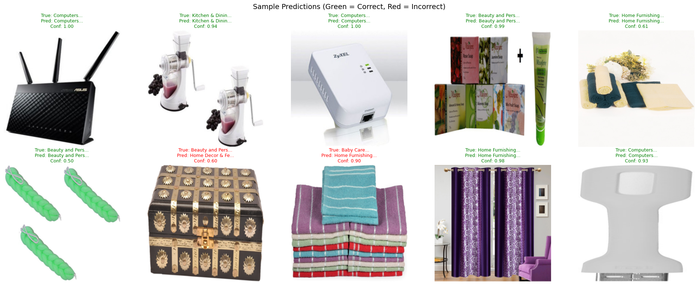

% Automated Product Classification for E-Commerce
% Projet 6 - Parcours Data Scientist
% [Votre Nom] - [Date]

---

# 1. Introduction & Enjeux Business

## Contexte
- **Client** : "Place de marché" (Marketplace style Flipkart).
- **Problématique** : L'inventaire grandit, mais la classification reste manuelle.
- **Risques** : Mauvaise indexation, perte de ventes, vendeurs frustrés.
- **Objectif technique** : Développer un "Proof of Concept" (POC) pour automatiser la catégorisation par moteur de recommandation ou classification directe.

---

# 2. Le Jeu de Données (Exploration)

## Dataset Flipkart
- **1050 articles** avec descriptions textuelles et images.
- **7 catégories cibles** (150 échantillons par classe) : Équilibre parfait pour éviter les biais de classe majoritaire.
- **Attributs exploités** : `product_name`, `description`, et l'image associée.

---

# 3. Pipeline de Prétraitement NLP (Texte)

## Nettoyage Rigoureux
- **Tokenisation & Cleaning** : Suppression des balises HTML, ponctuation, et caractères spéciaux.
- **Stop-words** : Utilisation de la bibliothèque NLTK pour filtrer les mots vides.
- **Lemmatisation** : Choix de réduire les mots à leur racine sémantique (ex: "running" -> "run") plutôt que le simple "stemming" trop brutal. 
- **Objectif** : Réduire la taille du vocabulaire tout en gardant le sens.

---

# 4. Prétraitement Vision (Image)

## Standardisation des visuels
- **Redimensionnement** : Passage en 224x224 pixels (format standard pour VGG16).
- **Normalisation** : Mise à l'échelle des intensités de pixels (0-1 ou -1 à 1) pour stabiliser la descente de gradient.
- **Filtrage** : Application facultative de flou gaussien pour réduire le bruit sur certains visuels.

---

# 5. Extraction de Features Texte (1/2)

## Approches Fréquentielles
- **Bag-of-Words (CountVectorizer)** : Simple comptage, mais ne gère pas l'importance relative.
- **TF-IDF** : Pondération par la fréquence inverse dans le document. Très efficace pour identifier les mots clés spécifiques à une catégorie (ex: "processor" pour Computers).

---

# 6. Extraction de Features Texte (2/2)

## Plongements Lexicaux (Embeddings)
- **Word2Vec** : Capture des relations de voisinage.
- **BERT** : Analyse contextuelle bidirectionnelle (Transformers).
- **Universal Sentence Encoder (USE)** : Encodage direct au niveau de la phrase. 
- **Analyse** : Les embeddings permettent de comprendre que "PC" et "Laptop" sont proches, ce que TF-IDF ne fait pas.

---

# 7. Extraction de Features Image : Approche Classique

## SIFT & Bag of Visual Words
- **SIFT (Scale-Invariant Feature Transform)** : Détection de points d'intérêt robustes aux rotations et changements d'échelle.
- **Quantification** : Création d'un dictionnaire visuel via K-Means sur les descripteurs SIFT.
- **Histogramme** : Chaque image est représentée par la fréquence d'apparition de ces "mots visuels".

---

# 8. Extraction de Features Image : Deep Learning

## Transfer Learning avec VGG16
- **Architecture** : Utilisation d'un modèle pré-entraîné sur 1,2 million d'images (ImageNet).
- **Feature Extraction** : On récupère la sortie de la dernière couche de convolution (avant les couches denses).
- **Avantage** : Le modèle a déjà appris à reconnaître des formes, des textures et des objets complexes.

---

# 9. Étude de Faisabilité : Réduction de Dimension

## PCA vs t-SNE
- **PCA** : Utilisé pour réduire le bruit initial et conserver la variance.
- **t-SNE** : Technique non-linéaire idéale pour la visualisation. Elle préserve les distances locales.
- **Interprétation** : Si les points de même couleur se regroupent, la classification est réalisable.

---

# 10. Résultats de Faisabilité : Analyse ARI

## Scores de Similarité (Clustering)
- **ARI (Adjusted Rand Index)** :
    - Image (VGG16) : **0.69** (Excellent regroupement).
    - Texte (USE) : ~0.45.
- **Observation** : L'image via VGG16 est ici plus discriminante que le texte seul pour séparer les 7 catégories.

---

# 11. Classification Supervisée : Modèle CNN

## Transfer Learning & Fine-Tuning
- **Base** : VGG16 "gelé" (poids fixes).
- **Tête du réseau** : Ajout de couches `GlobalAveragePooling2D` et `Dense` (256 neurones + Dropout).
- **Couche de sortie** : Softmax avec 7 neurones pour les 7 catégories.

---

# 12. Optimisation de l'Entraînement

## Stratégies employées
- **Data Augmentation** : Zoom, rotations et retournements horizontaux pour simuler un dataset plus grand.
- **Callbacks** : 
    - `EarlyStopping` : Arrêt dès que la perte de validation stagne.
    - `ReduceLROnPlateau` : Ajustement dynamique du taux d'apprentissage.

---

# 13. Performances du Modèle Final

## Métriques Clés
- **Accuracy Test** : **83.3%**
- **Précision / Recall** : Analyse par classe.
- **Points forts** : Watches (F1: 0.95), Kitchen (F1: 0.86).

---

# 14. Analyse de la Matrice de Confusion

## Pourquoi ces erreurs ?
- **Analogie Visuelle** : Un coussin (Furnishing) ressemble beaucoup à un objet de décoration (Decor).
- **Limites** : Le texte ne permet pas toujours de trancher si la description est trop générique.

---

# 15. Collecte de Données via API (Phase 3)

## Intégration OpenFood Facts
- **Script Python** : Utilisation du module `requests`.
- **Traitement** : Filtrage des produits pour n'extraire que les 10 meilleurs résultats pour "Champagne".
- **Données** : Récupération des ingrédients pour enrichir les métadonnées textuelles.

---

# 16. Conclusion et Perspectives

## Bilan du Projet
- Étude de faisabilité validée mathématiquement (ARI).
- Modèle supervisé performant (83% acc).
- Pipeline API opérationnel.

## Futur
- Déploiement dans un conteneur Docker.
- Test de modèles plus légers (MobileNet) pour une utilisation mobile.
- Amélioration du nettoyage texte (Correction orthographique).

---

# 17. Fin de la Présentation

## Merci pour votre attention
**Avez-vous des questions ?**
